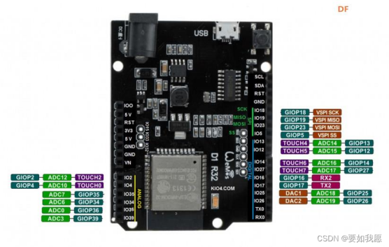
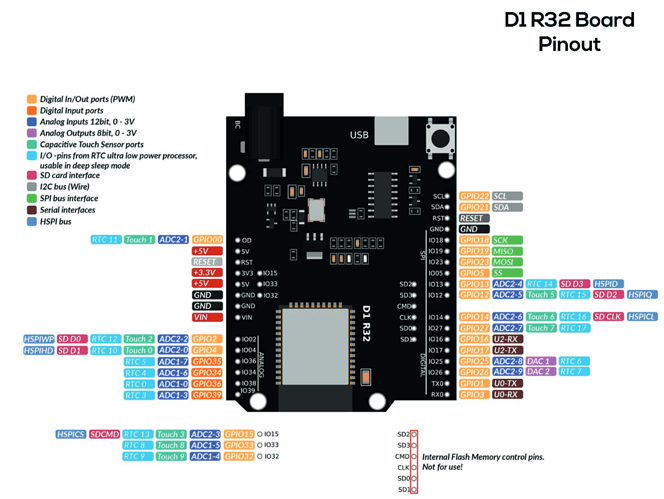
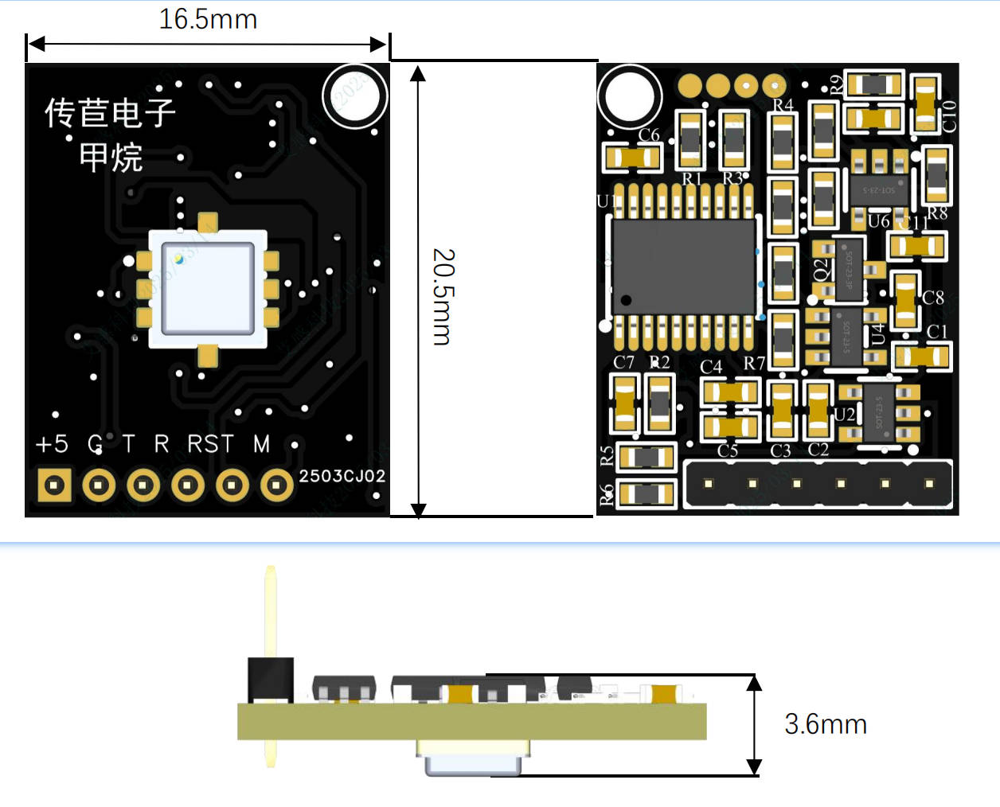
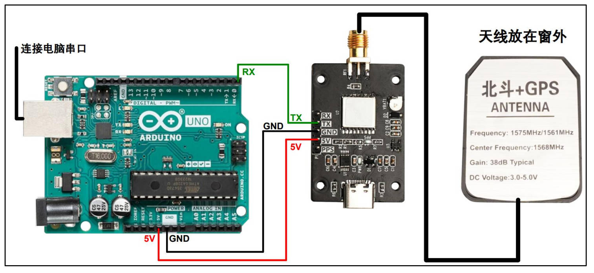

# 🎉 硬件介绍

欢迎大家参加 2025 年秀钟暑期实践课程！🌱

本教程由老师和助教团队 🧑‍🏫👩‍💻 精心编写，无论你是初学者还是有一定经验，都可以通过本教程快速完成开发板调试和代码工作 🛠️💡。

请大家按照本教程逐步操作。如果在学习或实践过程中遇到问题，欢迎随时在班级群或课上向老师、助教提问，我们会及时为大家解答与支持 🤝。

预祝大家实践学习顺利，收获满满！🚀✨

> 指导老师: 张小乐 & 助教团队: 蹇姚宇蝶  
> 2025年6月22日

## 硬件介绍：Arduino D1 R32 开发板与外部模块

### 1. Arduino D1 R32 开发板简介

Arduino D1 R32 是一款基于 ESP32 芯片的开发板，兼容 Arduino UNO 外形尺寸和大部分引脚排列，同时支持 WiFi 和蓝牙功能。该板适合 IoT 物联网开发，支持多种数字、模拟外设扩展。

**主要特点：**
- ESP32 主控，内置双核处理器
- 兼容 Arduino UNO 引脚布局（部分引脚复用/功能不同）
- 支持 3.3V/5V 输入
- 多路 UART、I2C、SPI 支持
- 具备丰富的 ADC、PWM、Touch 等功能

**典型应用：**  
智能传感、无线通讯、远程数据采集、物联网终端等。

---

### 2. D1 R32 引脚分布图

下图分别展示了 D1 R32 各功能引脚的实际布局及功能说明：

> **常用串口说明：**  
> - **TX0/RX0**（默认串口，编程/串口调试）  
> - **TX1/RX1** 和 **TX2/RX2**（可用作外设，如 GPS、气体传感器）

**常用引脚：**

| 功能         | ESP32 GPIO | 板上丝印     | 建议用途                 |
| ------------ | ---------- | ------------ | ------------------------ |
| 串口2 RX     | GPIO16     | RX2          | 气体传感器 TX            |
| 串口2 TX     | GPIO17     | TX2          | 气体传感器 RX            |
| 串口1 RX     | GPIO14     | RX1          | GPS TX                   |
| 串口1 TX     | GPIO27     | TX1          | GPS RX                   |
| 数字IO       | 多         | D0~D13, A0等 | 各类传感器、继电器控制等 |

---

### 3. 甲烷（CH₄）传感器模块引脚说明

下图为甲烷气体传感器模块：

**常见引脚定义（丝印如下）：**

| 丝印   | 功能说明       | 推荐连接           |
| ------ | -------------- | ------------------ |
| +5     | 电源正（+5V）  | 5V                 |
| G      | 地（GND）      | GND                |
| T      | 串口 TX        | 接开发板 RX（如 RX2）|
| R      | 串口 RX        | 接开发板 TX（如 TX2）|
| RST    | 复位           | 通常悬空或按需接   |
| M      | 其他功能       | 视具体模块说明     |

---

### 4. GPS 模块引脚说明

下图为典型 GPS 模块：

**常见引脚定义：**

| 丝印   | 功能说明       | 推荐连接           |
| ------ | -------------- | ------------------ |
| 5V     | 电源正（+5V）  | 5V                 |
| GND    | 地（GND）      | GND                |
| RX     | 串口 RX        | 接开发板 TX（如 TX1, 可选用 GPIO27）|
| TX     | 串口 TX        | 接开发板 RX（如 RX1, 可选用 GPIO14）|
| PPS    | 秒脉冲         | 通常不连接         |

---

### 5. 硬件连接示意（本次实验中）

- **甲烷传感器模块 → ESP32 D1 R32 开发板**
  - 传感器 TX（T） → 开发板 RX2（GPIO16）
  - 传感器 RX（R） → 开发板 TX2（GPIO17）
  - +5 → 5V，G → GND

- **GPS 模块 → ESP32 D1 R32 开发板**
  - GPS TX → 开发板 RX1（GPIO14）
  - GPS RX → 开发板 TX1（GPIO27）（如不使用，可悬空）
  - 5V → 5V，GND → GND

---

更多详细原理、各功能模块数据手册见[清华云盘链接](https://cloud.tsinghua.edu.cn/library/b3586dc7-5ed5-4de1-95b3-ae2557835748/2025%E7%A7%80%E7%A7%8D%E6%9A%91%E6%9C%9F%E5%AE%9E%E8%B7%B5%E8%AF%BE%E7%A8%8B%E6%96%87%E4%BB%B6/Arduino%E6%94%AF%E6%8C%81%E6%96%87%E4%BB%B6/%E4%BC%A0%E6%84%9F%E5%99%A8%E5%8F%82%E8%80%83%E6%96%87%E4%BB%B6)（Arduino支持文件/传感器参考文件）。

