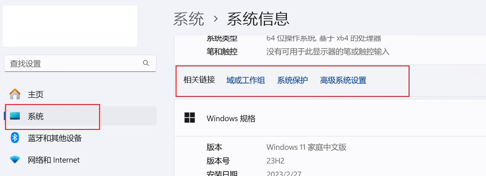
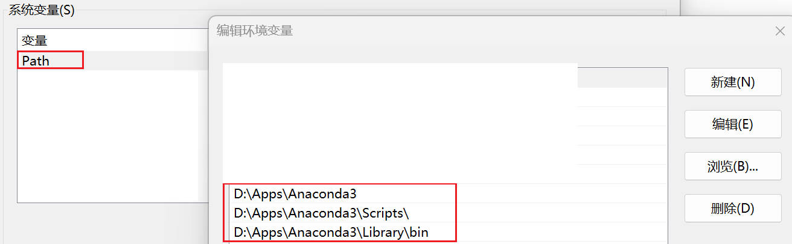
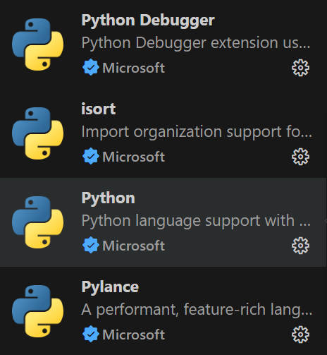
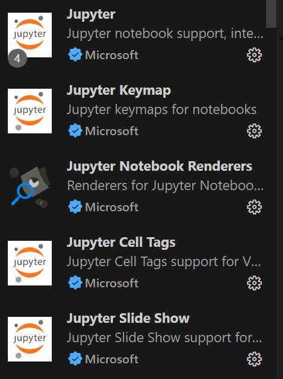
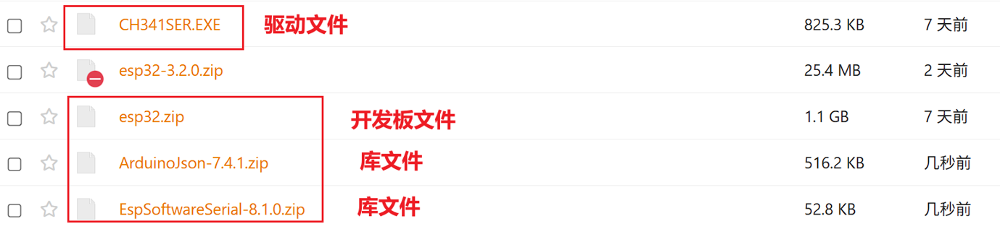
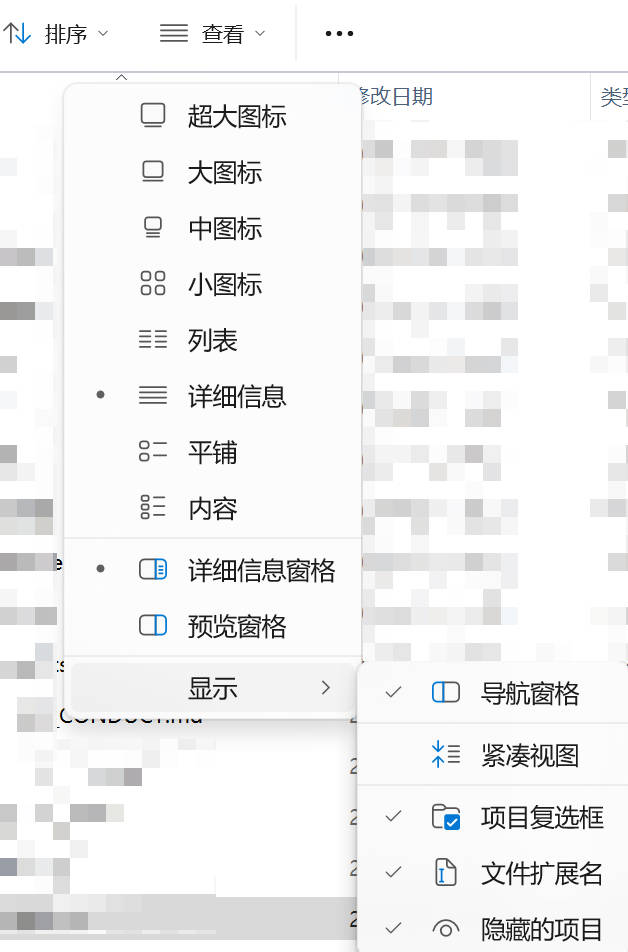
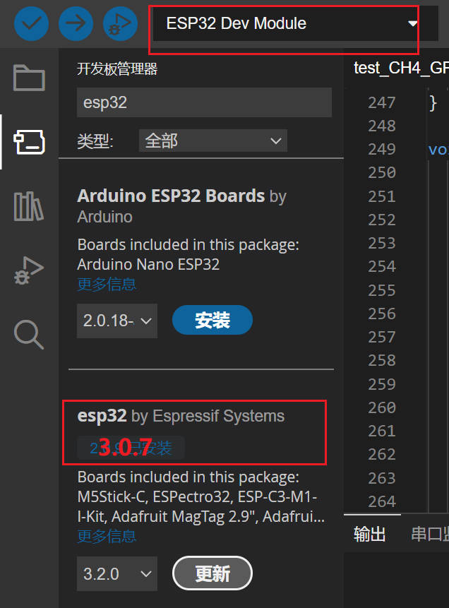
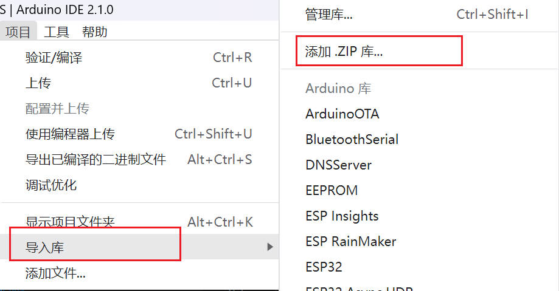

# 🎉 软件安装示例教程

欢迎大家参加 2025 年秀钟暑期实践课程！🌱

本教程由老师和助教团队 🧑‍🏫👩‍💻 精心编写，旨在帮助大家高效入门本次实践所需的编程与硬件基础知识。无论你是初学者还是有一定经验，都可以通过本教程快速完成环境配置、工具安装以及开发板调试等关键步骤 🛠️💡。

请大家按照本教程逐步操作。如果在学习或实践过程中遇到问题，欢迎随时在班级群或课上向老师、助教提问，我们会及时为大家解答与支持 🤝。

预祝大家实践学习顺利，收获满满！🚀✨

> 指导老师: 张小乐 & 助教团队: 蹇姚宇蝶 董强（软件测试） 成宇恒（硬件测试） 张嘉乐（硬件测试） 
> 2025年6月22日

## 1. Python 安装与IDE配置

- 在本教程中，我们推荐通过 **Anaconda** 安装和管理 Python 环境，这不仅方便科学计算和数据分析，也大大降低了初学者配置环境的难度。下面是详细的安装与配置步骤：

### 1.1 下载安装 Anaconda
1. 打开浏览器，访问 [Anaconda 官网](https://www.anaconda.com/)。
2. 在页面中选择适合您操作系统的安装包（Windows/Mac/Linux）。
3. 点击下载按钮，等待安装包下载完成。
4. [清华云盘链接](https://cloud.tsinghua.edu.cn/d/497796b840244f7eb211/)里也给大家准备了Anaconda安装包（在安装包文件里）。
5. 不清楚的请参考：[Anaconda 安装详细教程](https://blog.csdn.net/tqlisno1/article/details/108908775)。

### 1.2 配置环境变量（最好检查一下）
* 如果安装时没有将 Anaconda 添加到环境变量，需要手动设置。

  * **Windows**：
    1. 右键“此电脑” > “属性” > “高级系统设置” > “环境变量”。
    **Win 11 在“设置” > “系统” > “高级系统设置” > “环境变量”。**
    
    2. 在“系统变量”中找到 Path，点击“编辑”，添加 Anaconda 安装路径下的 `bin` 和 `Scripts` 文件夹（如：`.\Anaconda3`，`.\Anaconda3\Library\bin`和`.\Anaconda3\Scripts`）。
    
    3. 点击“确定”保存。
  * **Mac/Linux**：
    1. 打开终端，输入
       ```bash
       export PATH="/Users/用户名/anaconda3/bin:$PATH"
       ```
    2. 为永久生效，将上述命令加入 `~/.bashrc` 或 `~/.zshrc` 文件末尾。

### 1.3 验证安装
* 打开命令行（Windows：CMD 或 PowerShell，Mac/Linux：Terminal），输入以下命令：
  ```bash
  conda --version
  ```
  能正常显示版本号，说明 Anaconda 安装成功，环境变量也已配置好。
   

### 1.4 安装常用 IDE

* 推荐安装 Visual Studio Code（VS Code）或 PyCharm 作为 Python 开发环境。

  * [VS Code 官网](https://code.visualstudio.com/)
  * [PyCharm 官网](https://www.jetbrains.com/pycharm/)
* 安装后，建议在扩展市场中搜索并安装 “Python” 插件，以获得代码高亮、智能补全和调试功能。
* [清华云盘链接](https://cloud.tsinghua.edu.cn/d/497796b840244f7eb211/)里也给大家准备了VS Code 安装包（安装包文件里）。

### 1.5 VS Code 拓展库
安装拓展库




-------

## 2. Arduino 安装与环境配置

本节将指导你完成 Arduino 开发环境的安装与配置，帮助你快速上手 Arduino 编程和设备调试。

### 2.1 下载 Arduino IDE

1. 打开浏览器，访问 [Arduino 官网](https://www.arduino.cc/en/software)。
2. 在页面中选择适合你操作系统的安装包（Windows/Mac/Linux）。
3. 点击下载按钮，等待安装包下载完成。
4. [清华云盘链接](https://cloud.tsinghua.edu.cn/d/497796b840244f7eb211/)里也给大家准备了Arduino IDE安装包（安装包文件里）。

### 2.2 安装 Arduino IDE

1. 找到刚才下载的安装包，**双击**运行。
2. 按照安装向导的提示完成安装。
3. 安装过程中，建议勾选“安装 USB 驱动”（Windows 用户），确保电脑可以识别 Arduino 板子。

### 2.3 启动 Arduino IDE 并完成基本设置

1. 安装完成后，启动 Arduino IDE。
2. 如果第一次启动，会提示选择默认设置，直接确认即可。
3. 如果英文界面，你不太习惯的话，可以先更改为中文界面。选择菜单栏`File`（文件）> `Preferences`（首选项）> `Setting`（设置）。
3. 点击菜单栏的 `Tools`（工具），在 `Board`（开发板）下拉菜单中选择你所使用的 Arduino 板型（如：Arduino Uno、Arduino Nano 等）。
4. 用 USB 数据线连接 Arduino 板子和电脑。
5. 在 `Tools` > `Port` 菜单中，选择你的 Arduino 板子对应的端口（一般会自动识别，端口名称通常为 `COMx` 或 `/dev/ttyUSBx`）。

### 2.4 安装 ESP32 板和所需库

本节将介绍如何在 Arduino IDE 中添加 ESP32 板支持，并安装常用库，为后续开发打下基础。

#### 2.4.1 添加 ESP32 开发板支持

1. **打开 Arduino IDE**，点击菜单栏 `文件(File)` > `首选项(Preferences)`。

2. 在弹出的窗口下方找到 **“附加开发板管理器网址”**，在输入框中添加以下地址（如已有内容，用逗号分隔）：

   ```
   https://espressif.github.io/arduino-esp32/package_esp32_index.json
   ```

3. 点击 “确定” 保存设置。

4. 依次点击菜单栏 `工具(Tools)` > `开发板(Board)` > `开发板管理器(Board Manager)`。

5. 注意如果支持科学上网（还是建议使用2.4.2的方法），在开发板管理器搜索框中输入 `ESP32`，找到 **“esp32 by Espressif Systems”**，点击 **安装**，等待安装完成。

#### 2.4.2 离线手动安装 ESP32 支持（不使用科学上网）

由于部分同学无法通过 Arduino IDE 在线下载 ESP32 开发板包，我们提供了**离线安装方法**。已在清华云盘准备好相关文件，步骤如下：

1. **关闭所有正在运行的 Arduino IDE。**

2. **下载 ESP32 开发板支持文件：**

   * 从清华云盘获取预先下载好的 ESP32 离线包 （`esp32.zip`）（[清华云盘链接](https://cloud.tsinghua.edu.cn/d/497796b840244f7eb211/)）。
   * 其他需要下载的文件有：`CH341SER.EXE`，`ArduinoJson-7.4.1.zip` 和 `EspSoftwareSerial-8.1.0.zip`
   
   * esp32的版本是3.0.7。

3. **解压并放置文件：**

   * 解压后，文件夹中应包含 `hardware` 和 `tools` 两个子文件夹。

   * 将整个 `esp32` 文件夹，**复制到以下路径**（注意不同电脑用户名和路径可能不同）：

     ```
     C:\Users\***\AppData\Local\Arduino15\packages\esp32
     ```

     > 其中 `***` 为你的电脑登录用户名（或管理员名）。
     > 如果找不到 AppData 请打开隐藏文件夹。

   * 如果 `packages` 或 `esp32` 文件夹不存在，可以手动创建。

4. **检查结构：**

   * 正确路径下应为：

     ```
     C:\Users\你的用户名\AppData\Local\Arduino15\packages\esp32\hardware
     C:\Users\你的用户名\AppData\Local\Arduino15\packages\esp32\tools
     ```

5. **重新打开 Arduino IDE，检查开发板：**

   * 启动 Arduino IDE。
   * 在 `工具(Tools)` > `开发板(Board)` 菜单下应能看到 ESP32 相关开发板选项（如 `ESP32 Dev Module`）。
   * 若已显示，说明安装成功。
   
   * 建议这一步也安装一下驱动：点击`CH341SER.EXE` 选择安装即可。


**补充说明**：

* 如果找不到 `AppData` 文件夹，可能是隐藏文件夹，需在资源管理器中开启“显示隐藏的文件”。
* 本方法不需要网络即可完成安装，适用于因网络原因无法在线安装的场景。

#### 2.4.3 安装所需库

为了后续联网、HTTP通信、Json处理等功能，需要提前安装以下库：

* **HTTPClient**、**WiFi**、**WiFiClient**、**ArduinoJson**、**HardwareSerial**、**SoftwareSerial**（部分库为 ESP32 自带，部分需手动安装）。

##### 安装第三方库的方法：

1. 建议方法：
- 将 `ArduinoJson-7.4.1.zip` 和 `EspSoftwareSerial-8.1.0.zip` 复制到 C:\Users\ \AppData\Local\Arduino15\staging\libraries 文件夹下。
- 如果 `libraries` 文件夹不存在，可以手动创建。回到Arduino IDE页面点击 `项目` > `导入库`  >  `添加 .ZIP 库` 选择刚才两个zip文件安装。 
2. 不建议方法：点击菜单栏 `工具(Tools)` > `库管理器(Library Manager)`。在右上角搜索对应库名，例如 `ArduinoJson`，点击 **安装**。依次搜索并安装其他所需库。

**常用库引用示例：**

```cpp
#include <HTTPClient.h>
#include <WiFi.h>
#include <WiFiClient.h>
#include <HardwareSerial.h>
#include <ArduinoJson.h>
#include <SoftwareSerial.h>
```

> 提示：`HTTPClient`、`WiFi`、`WiFiClient`、`HardwareSerial`、`esp_task_wdt` 等通常已随 ESP32 支持包安装，无需单独添加。
> `ArduinoJson` 和 `SoftwareSerial` 需要手动通过库管理器安装。

#### 2.4.4 参考教程

如需更详细的图文教程，可参考：[ESP32 安装教程（CSDN）](https://blog.csdn.net/qq_57139623/article/details/132031334)和
[解决Arduino IDE无法安装esp32的问题](https://blog.csdn.net/weixin_43034503/article/details/128733085)

### 2.5 常见问题与解决办法

* **找不到开发板端口**：请检查 USB 线是否支持数据传输，并确认已安装相关驱动 `CH341SER`（[清华云盘链接](https://cloud.tsinghua.edu.cn/d/497796b840244f7eb211/)）。
* **上传失败**：可以尝试更换 USB 端口、重启 Arduino IDE，或重新选择开发板型号和端口。


