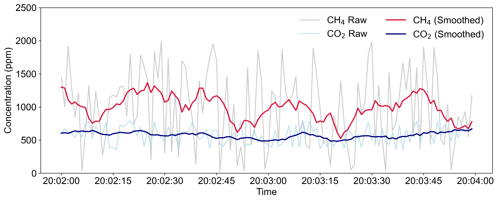
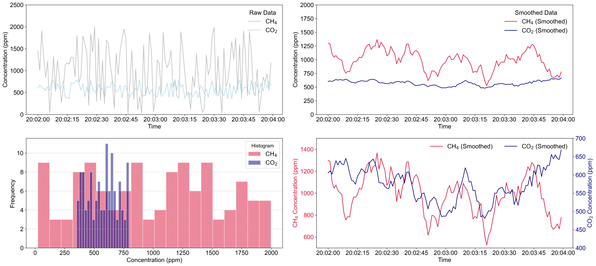
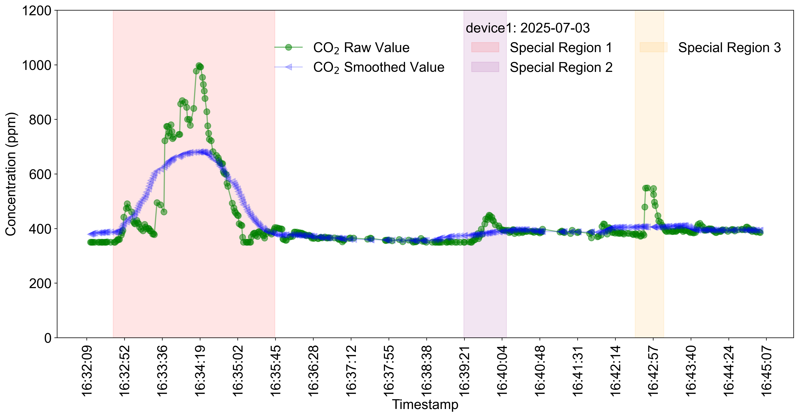
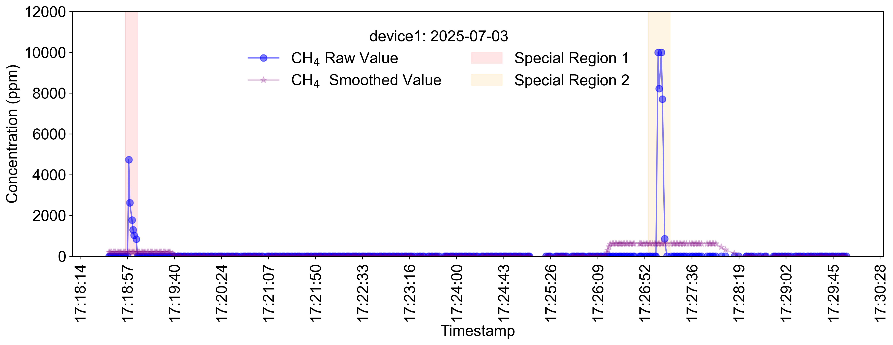

# 🎉 Python数据处理示例教程

欢迎大家参加 2025 年秀钟暑期实践课程！🌱

本教程由老师和助教团队 🧑‍🏫👩‍💻 精心编写，旨在帮助大家高效入门本次实践所需的编程基础知识。无论你是初学者还是有一定经验，都可以通过本教程快速完成代码调试和数据可视化展示 🛠️💡。

请大家按照本教程逐步操作。如果在学习或实践过程中遇到问题，欢迎随时在班级群或课上向老师、助教提问，我们会及时为大家解答与支持 🤝。

预祝大家实践学习顺利，收获满满！🚀✨

> 指导老师: 张小乐 & 助教团队: 蹇姚宇蝶  
> 2025年6月22日

# 传感器数据合成、导出与基础可视化教程

## 1. 代码功能说明

本示例用于演示如何**自动生成环境传感器实验数据**，并完成标准格式的数据导出与多样化可视化。适用于物联网、环境监测等领域的数据教学、算法调试、展示和前后端接口仿真。

### 主要功能包括：

- 自动生成 CO₂（350至800ppm）、CH₄（0至2000ppm）数据
- 构造仿真的 GPS 定位点（北京区域微扰）
- 以标准格式合成为 JSON/CSV 两种文件
- 多样化可视化：
  - 浓度随时间折线图（含原始与平滑）
  - 数据分布直方图
  - 双 Y 轴浓度对比（便于多传感器关联）
  - 可扩展至轨迹线地图（进阶功能）

## 2. 主要代码结构

### 2.1 数据生成与导出

- 利用 numpy 随机数生成 CO₂、CH₄ 浓度数据，GPS 坐标模拟小范围随机游走
- 所有数据按时间戳对齐
- JSON 文件便于接口开发或仿真模拟，CSV 文件便于后续分析和可视化

### 2.2 数据读取与可视化

- 采用 pandas 读取保存的 CSV 文件
- 支持：
  - CH₄、CO₂ 浓度随时间变化折线图
  - 支持基础清洗（缺失填补、异常剔除、滑动平均），自动美化坐标和标签。
  - 四宫格子图包括：原始折线、平滑曲线、分布直方图、CH₄/CO₂ 双 Y 轴折线。

## 3. 使用方法

1. **运行数据生成脚本**：自动保存标准 JSON 和 CSV 文件。
2. **运行数据可视化脚本**：读取保存的数据文件，生成高质量折线、直方、双轴等图表。

## 4. 结果展示

- **CH₄、CO₂ 浓度时序曲线**：动态展示数据波动与趋势，平滑处理便于观测整体变化。
- **数据分布直方图**：了解各气体在本批数据中的概率分布，有助于发现异常或设计分档。
- **双 Y 轴对比**：同步观测不同气体的变化同步性、相关性。

## 5. 注意事项与扩展建议

- 数据可用于物联网终端仿真、边端算法训练、前端可视化开发等多场景。
- 可拓展为多设备、多气体协同仿真；或增加真实采样点的数据融合。

## 6. 完整代码
### 6.1 如何写一个能上传的JSON/CSV文件呢？
```python
# 导入需要的库
import json
import numpy as np
from datetime import datetime, timedelta
import pandas as pd
from tqdm import trange

# 设置时间戳
timerange = 120 # 时间范围：120秒
start_time = datetime(2025, 6, 23, 20, 2, 0) # 起始时间：2025年6月23日20点0分0秒
timestamps = [start_time + timedelta(seconds=i) for i in range(timerange)] # 生成120个连续的时间戳
timestamps_str = [t.strftime("%Y-%m-%d %H:%M:%S") for t in timestamps] # 格式化时间戳为字符串

# 设备识别号，这里一定要和设备的代码一样
username = 'test1'
device_name = "esp32_001"
device_key = "abc123"

# 构造 CO, CH4 数据（ppm）
np.random.seed(0) # 设置随机种子以确保结果可复现
co2_data = np.round(np.random.uniform(350, 800, timerange), 3).tolist() # 生成 CO2 数据， 范围在 350 到 800 ppm
ch4_data = np.round(np.random.uniform(0, 2000, timerange), 3).tolist() # 生成 CH4 数据， 范围在 0 到 2000 ppm

# 构造 GPS 数据（围绕某一点微调）
lat_base, lon_base = 39.9042, 116.4074  # 北京某点
latitudes = (lat_base + np.random.normal(0, 0.0003, timerange)).round(6).tolist() # 纬度微调
longitudes = (lon_base + np.random.normal(0, 0.0003, timerange)).round(6).tolist() # 经度微调

# 合并数据：注意格式
combined_data_json = [] # 初始化合并数据列表
combined_data_csv = [] # 初始化合并数据列表，用于 CSV
for i in trange(timerange):
    combined_data_json.append({
        "username": username,
        "device_name": device_name,
        "device_key": device_key,
        "timestamp": timestamps_str[i],
        "lon": longitudes[i],
        "lat": latitudes[i],
        "data": {
            "CO2": co2_data[i],
            "CH4": ch4_data[i],
        },
    })
    combined_data_csv.append({
        "username": username,
        "device_name": device_name,
        "device_key": device_key,
        "timestamp": timestamps_str[i],
        "lon": longitudes[i],
        "lat": latitudes[i],
        "CO2": co2_data[i],
        "CH4": ch4_data[i],
    })


# # 保存为 JSON 文件
# output_path = "./dataset/sensor_gps_combined.json" # 保存的相对路径
# with open(output_path, "w") as f:
#     json.dump(combined_data_json, f, indent=2)

# 构建CSV格式的数据，先转为DataFrame
df = pd.DataFrame(combined_data_csv)
csv_output_path = "./dataset/sensor_gps_combined.csv" # 保存的相对路径
df.to_csv(csv_output_path, index=False, encoding='utf-8-sig') # 保存为 CSV 文件，使用 utf-8-sig 编码
df
```
输出样例：
```python
100%|██████████| 120/120 [00:00<?, ?it/s]
```
### 6.2 Python数据可视化

```python
import pandas as pd
import numpy as np
import matplotlib.pyplot as plt
from matplotlib.dates import DateFormatter

# 保证中文和负号正常显示
plt.rcParams['font.family'] = 'Arial' # 设置字体为 Arial
plt.rcParams['font.size'] = 16 # 设置字体大小
plt.rcParams['axes.unicode_minus'] = False # 确保负号正常显示

# 读取数据
df = pd.read_csv('./dataset/sensor_gps_combined.csv', encoding='utf-8-sig')
df['timestamp'] = pd.to_datetime(df['timestamp'])

# ========== 数据清洗与预处理 ==========

# 检查和填补缺失值
print(df.isnull().sum())
df['CH4'] = df['CH4'].interpolate() # 简单线性插值填补缺失
df['CO2'] = df['CO2'].interpolate()

# 简单离群值剔除（Z-score > 3 的数据点设为nan）
for gas in ['CH4', 'CO2']:
    z = (df[gas] - df[gas].mean()) / df[gas].std()
    df.loc[np.abs(z) > 3, gas] = np.nan
    df[gas] = df[gas].interpolate()

# 计算滑动平均（平滑曲线）
window = 10  # 平滑窗口（秒）
df['CH4_smooth'] = df['CH4'].rolling(window, min_periods=1, center=True).mean()
df['CO2_smooth'] = df['CO2'].rolling(window, min_periods=1, center=True).mean()

# ========== 1. 标准折线+平滑线 ==========
fig, ax = plt.subplots(figsize=(12, 5), dpi=300)
ax.plot(df['timestamp'], df['CH4'], color='grey', alpha=0.4, label=r'CH$_4$ Raw')
ax.plot(df['timestamp'], df['CO2'], color='lightblue', alpha=0.8, label=r'CO$_2$ Raw')
ax.plot(df['timestamp'], df['CH4_smooth'], color='crimson', linewidth=2, label=r'CH$_4$ (Smoothed)')
ax.plot(df['timestamp'], df['CO2_smooth'], color='navy', linewidth=2, label=r'CO$_2$ (Smoothed)')
ax.set_xlabel('Time') # 设置X轴标签
ax.set_ylabel('Concentration (ppm)') # 设置Y轴标签
ax.legend(frameon=False, loc='upper right', ncol=2) # 设置图例
ax.xaxis.set_major_formatter(DateFormatter('%H:%M:%S'))
ax.set_ylim(0, 2500)  # 设置Y轴范围
plt.tight_layout()
plt.show()

# ========== 2. 子图布局：原始值、平滑值、直方图 ==========
fig, axs = plt.subplots(2, 2, figsize=(22, 10), dpi=300)
axs = axs.flatten()

# 原始曲线
axs[0].plot(df['timestamp'], df['CH4'], label=r'CH$_4$', color='grey', alpha=0.5)
axs[0].plot(df['timestamp'], df['CO2'], label=r'CO$_2$', color='lightblue', alpha=0.9)
axs[0].legend(frameon=False, title='Raw Data')
axs[0].set_ylabel('Concentration (ppm)')
axs[0].set_xlabel('Time')
axs[0].set_ylim(0, 2500)
axs[0].xaxis.set_major_formatter(DateFormatter('%H:%M:%S'))

# 平滑曲线
axs[1].plot(df['timestamp'], df['CH4_smooth'], label=r'CH$_4$ (Smoothed)', color='crimson')
axs[1].plot(df['timestamp'], df['CO2_smooth'], label=r'CO$_2$ (Smoothed)', color='navy')
axs[1].legend(frameon=False, title='Smoothed Data')
axs[1].set_ylabel('Concentration (ppm)')
axs[1].set_xlabel('Time')
axs[1].set_ylim(0, 2000)
axs[1].xaxis.set_major_formatter(DateFormatter('%H:%M:%S'))

# 直方图
axs[2].hist(
    df['CH4'], bins=20, color='crimson', alpha=0.5, 
    label=r'CH$_4$', edgecolor='white', linewidth=1.2
)
axs[2].hist(
    df['CO2'], bins=20, color='navy', alpha=0.5, 
    label=r'CO$_2$', edgecolor='white', linewidth=1.2
)
axs[2].legend(frameon=True, title='Histogram', title_fontsize=13)
axs[2].set_xlabel('Concentration (ppm)')
axs[2].set_ylabel('Frequency')
axs[2].grid(axis='y', linestyle='--', alpha=0.7)

# 双Y轴曲线
# 第4个子图，使用双Y轴显示平滑曲线
ax1 = axs[3]  # 第3个子图
ax2 = ax1.twinx()
ax1.plot(df['timestamp'], df['CH4_smooth'], color='crimson', label=r'CH$_4$ (Smoothed)')
ax2.plot(df['timestamp'], df['CO2_smooth'], color='navy', label=r'CO$_2$ (Smoothed)')
ax1.set_ylabel(r'CH$_4$ Concentration (ppm)', color='crimson')
ax1.tick_params(axis='y', labelcolor='crimson')
ax2.tick_params(axis='y', labelcolor='navy')
ax2.set_ylabel(r'CO$_2$ Concentration (ppm)', color='navy')
ax1.set_xlabel('Time')
ax1.xaxis.set_major_formatter(DateFormatter('%H:%M:%S'))
ax1.set_ylim(500, 1500)  # 设置CH4的Y轴范围
ax2.set_ylim(400, 700)  # 设置CO2的Y轴范围

# 可选：在子图右上角单独加图例（双Y轴时需要手动合并legend）
lines, labels = [], []
for ax in [ax1, ax2]:
    for l in ax.get_lines():
        lines.append(l)
    for label in ax.get_legend_handles_labels()[1]:
        labels.append(label)
ax1.legend(lines, labels, loc='upper right', frameon=False, ncol=2)

plt.tight_layout()
plt.show()

```
数据可视化样例：



---
### 6.3 Python数据可视化更新
```python
import pandas as pd
import numpy as np
import matplotlib.pyplot as plt
from matplotlib.dates import DateFormatter
import matplotlib.dates as mdates
import matplotlib.ticker as ticker

# 保证负号正常显示
plt.rcParams['font.family'] = 'Arial' # 设置字体为 Arial
plt.rcParams['font.size'] = 18 # 设置字体大小
plt.rcParams['axes.unicode_minus'] = False # 确保负号正常显示


# 读取数据
df = pd.read_csv('./device1.csv', encoding='utf-8-sig')
df['timestamp'] = pd.to_datetime(df['timestamp']) # 将时间戳列转换为 datetime 类型
df = df[(df['value'] >= 0)] # 过滤掉负值数据
df_co2 = df[(df['sensor_type'] == 'CO2 ')].copy() # 注意 CO2 后有一个空格，使用 .copy() 避免警告
df_ch4 = df[(df['sensor_type'] == 'CH4')].copy() # 注意 CH4 后没有空格，使用 .copy() 避免警告

# 计算滑动平均（平滑曲线）
window = 60  # 平滑窗口（秒）
# rolling() 方法计算滑动平均, window 参数指定窗口大小，min_periods=1 确保至少有一个数据点时计算平均值，center=True 使得平均值居中
df_co2['smooth'] = df_co2['value'].rolling(window, min_periods=10, center=True).mean()
df_ch4['smooth'] = df_ch4['value'].rolling(window, min_periods=10, center=True).mean()

# 绘制 CO2 数据图
df_co2_plot = df_co2.copy() # 复制 CO2 数据
df_co2_plot = df_co2_plot.sort_values(by='timestamp') # 按时间戳排序
df_co2_plot = df_co2_plot[(df_co2_plot['timestamp'] >= '2025-07-03 16:30:00') & (df_co2_plot['timestamp'] <= '2025-07-03 16:45:00')] # 过滤时间范围
fig, ax = plt.subplots(figsize=(15, 8), dpi=300)
ax.plot(df_co2_plot['timestamp'], df_co2_plot['value'],
        marker='o', linestyle='-', alpha=0.5,  # 设置透明度
        markersize=8,  # 设置点的大小
        color='green', label=r'CO$_2$ Raw Value')
ax.plot(df_co2_plot['timestamp'], df_co2_plot['smooth'],
        marker='<', linestyle='-', alpha=0.2,  # 设置透明度
        markersize=8,  # 设置点的大小
        color='b', label=r'CO$_2$ Smoothed Value')
ax.axvspan(pd.Timestamp('2025-07-03 16:32:40'), pd.Timestamp('2025-07-03 16:35:45'),
           color='red', alpha=0.1, label='Special Region 1')
ax.axvspan(pd.Timestamp('2025-07-03 16:39:21'), pd.Timestamp('2025-07-03 16:40:10'),
           color='purple', alpha=0.1, label='Special Region 2')
ax.axvspan(pd.Timestamp('2025-07-03 16:42:37'), pd.Timestamp('2025-07-03 16:43:10'),
           color='orange', alpha=0.1, label='Special Region 3')
ax.set_xlabel('Timestamp')
ax.set_ylabel('Concentration (ppm)')
ax.legend(frameon=False, loc='upper right', ncol=3, title='device1: 2025-07-03') # 图例放在右上角
ax.xaxis.set_major_formatter(DateFormatter('%H:%M:%S')) # 设置 x 轴时间格式
ax.xaxis.set_major_locator(ticker.MaxNLocator(nbins=20, prune='both')) # 设置 x 轴刻度数量
ax.set_ylim(0, 1200) # 设置 y 轴范围
plt.xticks(rotation=90) # 添加 rotation=45 可以避免 x 轴标签重叠
plt.tight_layout() # 自动调整布局
plt.show() # 显示图像


# 绘制 CH4 数据图
df_ch4_plot = df_ch4.copy()
df_ch4_plot = df_ch4_plot.sort_values(by='timestamp') # 按时间戳排序
df_ch4_plot = df_ch4_plot[(df_ch4_plot['timestamp'] >= '2025-07-03 17:15:00') & (df_ch4_plot['timestamp'] <= '2025-07-03 17:30:00')] # 过滤时间范围
fig, ax = plt.subplots(figsize=(15, 6), dpi=300) # 设置图像大小和分辨率
ax.plot(df_ch4_plot['timestamp'], df_ch4_plot['value'], marker='o',
        markersize=8,  # 设置点的大小
        linestyle='-', alpha=0.5, color='blue', label=r'CH$_4$ Raw Value') # 绘制原始数据点
ax.plot(df_ch4_plot['timestamp'], df_ch4_plot['smooth'], marker='*',
        markersize=8,  # 设置点的大小
        linestyle='-', alpha=0.2, color='purple', label=r'CH$_4$  Smoothed Value') # 绘制平滑曲线
ax.axvspan(pd.Timestamp('2025-07-03 17:18:56'), pd.Timestamp('2025-07-03 17:19:07'),
           color='red', alpha=0.1, label='Special Region 1') # 绘制特殊区域1
ax.axvspan(pd.Timestamp('2025-07-03 17:26:56'), pd.Timestamp('2025-07-03 17:27:16'),
           color='orange', alpha=0.1, label='Special Region 2') # 绘制特殊区域2
ax.set_xlabel('Timestamp')
ax.set_ylabel('Concentration (ppm)')
ax.legend(frameon=False, loc='upper left', ncol=2, title='device1: 2025-07-03',
          bbox_to_anchor=(0.2, 0.98))
ax.xaxis.set_major_formatter(DateFormatter('%H:%M:%S')) # 设置 x 轴时间格式
ax.xaxis.set_major_locator(ticker.MaxNLocator(nbins=20, prune='both')) # 设置 x 轴刻度数量
ax.set_ylim(0, 12000) # 设置 y 轴范围
plt.xticks(rotation=90) # 添加 rotation=45 可以避免 x 轴标签重叠
plt.tight_layout() # 自动调整布局
plt.show() # 显示图像
```
 

如需进一步绘图风格美化、统计分析、设备多线程数据生成等进阶功能，请自行学习~
